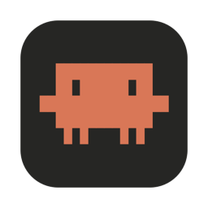

<p align="center">
  
</p>

<h1 align="center">Claude FM</h1>

<p align="center">
  <em>Music for thinking and building, one click away in your menu bar.</em>
</p>

---

Claude FM is a tiny macOS menu bar app that plays the
[Claude FM livestream](https://www.youtube.com/watch?v=tRsQsTMvPNg) without a browser tab,
a Dock icon, or a single video frame on your screen. Click the little radio, hit play,
and get back to building. Clawd will keep the vibes going. 🦀🎶

## What it does

- **Lives in the menu bar.** No Dock icon, no windows, no clutter. The radio icon fills in while it's playing.
- **Play and pause.** That's it. It's a livestream, so there's nothing to skip. When you resume,
  it jumps straight back to the live edge instead of playing whatever you missed.
- **Its own volume slider.** Turn Claude FM down without touching your system volume or your
  call audio. Your level is remembered between launches.
- **Open at login.** Flip a switch and Claude FM is waiting in your menu bar every time you log in.
- **Play when opened.** Pair it with "Open at login" and the music starts the moment your Mac does.
- **Now Playing, starring Clawd.** Claude FM shows up in Control Center and responds to your
  keyboard's play/pause key, with the Claude Code mascot as the album art instead of a YouTube thumbnail.
- **Space bar toggles playback** while the menu is open, and ⌘Q quits.

## Requirements

- macOS 26 or later
- Xcode 26 or later to build it

## Build and run

```bash
git clone https://github.com/LorenzoZemp/ClaudeFMPlayer.git
cd ClaudeFMPlayer
open ClaudeFM.xcodeproj
```

Press ⌘R in Xcode. Look for the radio in your menu bar (not the Dock, it won't be there).

Prefer the command line?

```bash
xcodebuild -project ClaudeFM.xcodeproj -scheme ClaudeFM -derivedDataPath build build
open build/Build/Products/Debug/ClaudeFM.app
```

The project signs "to run locally", so you don't need a developer team to try it.

## How it works (and why)

YouTube doesn't hand out a plain audio URL for its streams. The obvious approaches all have catches:

| Approach | Why not |
| --- | --- |
| Point `AVPlayer` at an HLS link | YouTube's web and app clients now stream through SABR, a protocol that needs signed tokens. There's no stable `.m3u8` to grab. |
| Resolve the stream with `yt-dlp` at runtime | Needs an extra tool installed, breaks whenever YouTube changes its internals, and the links it returns expire after a few hours. |
| **Hidden YouTube embed player** ✅ | Uses YouTube's own official player, so it keeps working as YouTube changes things behind it. |

So Claude FM loads the official
[YouTube IFrame Player API](https://developers.google.com/youtube/iframe_api_reference)
inside a `WKWebView` that you never see. The Swift side talks to it with a few lines of
JavaScript (`play`, `pause`, `setVolume`) and hears back about player state through a
`WKScriptMessageHandler`.

A few details that make it behave:

- **The player is created on first play**, so an idle Claude FM costs next to nothing.
- **It's parked in a borderless window far off screen.** WebKit refuses to start media in a page
  that isn't in a window, and this keeps it out of sight, out of the window cycle, and unclickable.
- **It's only 320×180**, which nudges YouTube into a low video quality so it isn't decoding HD
  frames nobody will ever look at.
- **It's given a web origin**, because YouTube rejects embeds that arrive with no referrer.

The tradeoff: a web view is heavier than a native audio player (expect WebKit's helper processes
to use a few percent of CPU while playing), and YouTube may occasionally show an ad before the
stream starts. In return, you get something that doesn't break every time YouTube shuffles its
furniture.

## Project layout

```
ClaudeFM/
├── ClaudeFMApp.swift     # The MenuBarExtra scene and "play when opened"
├── PlayerMenu.swift      # The menu: play/pause, volume, settings, quit
├── StreamPlayer.swift    # Hidden YouTube player and its state
├── NowPlaying.swift      # Control Center, media keys and Clawd's album art
└── LaunchAtLogin.swift   # "Open at login" via SMAppService
```

## About Clawd

The artwork is a pixel-for-pixel trace of Clawd, the little critter from the Claude Code welcome
banner, drawn in Claude orange on a warm dark background. Claude, Claude Code and Clawd belong to
Anthropic. This is a fan-made project and isn't affiliated with or endorsed by Anthropic or YouTube.

## License

MIT. Go forth and vibe.
